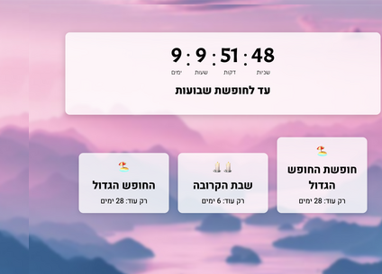

# Ad Matay?

## Description
*Ad Matay?* (Hebrew: "Until When?") is a fun and informative React application designed to bring a smile to students (and teachers!) in Israel. It provides a dynamic countdown to the next school vacation, alongside timers for the upcoming Shabbat and the next major upcoming holiday.

## Features
- Dynamic Countdown: The countdown automatically updates, reflecting the time remaining until the next school vacation based on the current Hebrew calendar year.
- Shabbat Timer: A convenient timer displays the days remaining until the next Shabbat, a weekly day of rest in Israel.
- Holiday Countdown: An additional countdown highlights the upcoming major holiday, providing its name and remaining days.
- Engaging Interface: The clean and modern design makes checking "Ad Matay?" a delightful experience.

## Technical Highlights:
- React Framework: Built using React, a popular JavaScript library for creating user interfaces.
- Hebcal Library: Leverages the @hebcal/core library to accurately determine school vacations based on the Hebrew calendar.

## Online Application
You can access the online application at the following link:
https://admatay.netlify.app

## Future Development
- More customizable countdowns for different holidays and personal events.

- Implement user preferences for notifications and reminders

## License
This project is licensed under a free license. All information and code were created by Aviel Ben-Eliyahu as part of a learning exercise.

## Author
Aviel Ben-Eliyahu - Developer and creator of "Ad Matay?"

## Contact
For any inquiries or suggestions, please get in touch with me at avielmbe@gmail.com.

[Edit in StackBlitz next generation editor ⚡️](https://stackblitz.com/~/github.com/Avielbe/HebCal-v5.1)
